+++
title = "Implementation"
+++

## Introduction

This page explains the implementation of our system, for reasoning behind the choice of frameworks see our research page.

## Front End

The front end is a [react js](https://reactjs.org/) app using a browser router to simulate the different pages. It also uses [redux js](https://redux.js.org/) for state management.

The `src` folder has four subdirectories worthy of mention:
- `pages`: where the code for all the individual routable pages goes e.g. `/Register` or `/Login`.
- `components`: individual components that may be shared across multiple pages.
- `common`: configuration values and thin wrappers around `api` calls.
- `state`: code that handles state management with redux.

## Deployment

### App & Deploy config

Before the deployment can begin admins need to provide and app config, an example one is given in the root of the repository.

During the deployment the app config is merged with some generated outputs from the deployment to produce a deploy config. Both the front and back ends get a deploy config file automatically generated during a deploy. This file will is in the `.gitignore` file and not be put into the git history. This is because it may contain sensitive or deployment specific information. This is useful for end users but may be cause difficulty with development. This is why for the client side there is `devDeployConfig.json` file so that the developers can provide all team members with a consistent environment. This file is automatically loaded if the front end detects it is running in "development" mode (essentially if the app is run via `npm start` instead of `npm run build`).

### Terraform

The development team can edit the file `terraform/configuration.tf` which describes the state of the deployment and gives Terraform all the information it needs to update the deployment. If we update the app and require new resources Terraform can keep track of the deployed state and update changes in place where possible.

### Deploy script

There is a file called `deploy.py` in the root of the project. The script is designed to be as helpful as possible for people who aren't technically experienced. Before anything begins the script checks for dependencies and common errors such as missing programs or forgetting to login using `az login`. If any of these errors are detected then the program will exit with helpful error messages.

It first runs Terraform and then merges the provided app config to produce the deploy configs. It will then `npm install` all the require packages for both the server and client. For the client it then builds the static react app and uploads it to the server and for the server it just uploads the source files directly.

## Feature Implementation

### SSO Login

Our login system is entirely through Microsoft SSO allowing users to use their university accounts. This has a number of benefits including reducing the need for us to store user account details. We implement this using a redirect flow which we found works better than popups on many devices including mobiles. The system redirects the user to Microsoft's website where the user is prompted to log in. Once they have the user is redirected back to our app along with their access token. We then store this access token is our `redux` state which allows us to query the API on behalf of them. This token is also required by all of our endpoints to verify the identity of the user.

### Two factor Authentication (2FA) and Registration

When users register for lectures they must authenticate that it's actually them using a 2FA code. Before the user can register they must first setup their 2FA. When the user requests to set it up our app calls an Azure function endpoint which generates a new 2FA secret and then stores a record in the database (an Azure Cosmos DB) with the user ID but it marks the record with "has_verified" set to false. This is because the user isn't allow to reset their 2FA (for security as it would defeat the purpose of 2FA) but we don't want to lock it in until the user has verified that they've stored the secret. This is why we ask the user to enter the code once before it's marked as verified. Once this code is entered successfully the user is then able to use the code the register for classes. This is achieved by passing along the registration event to ORCA.

The algorithm for 2FA is TOTP which allows a shared secret to generate 6 digit numbers that are only valid for 30 second periods.

### Settings and Customisation

We store user settings as a JSON string inside an Azure Cosmos DB. Each JSON string is associated with a user ID which uniquely identifies the user. When the user loads a page which is customised by settings the app will call our Azure function endpoint to request the user settings. By default many setting values will be `null`/`undefined`  which is why we automatically fill in these values with a list of defaults. Since it takes some time to download the settings our app for a short amount of time uses these defaults until the real settings can be used.

The Settings page is the only place where users can edit these values. Whenever the user makes a change the system queues an `update` event and as long as the user doesn't edit any more settings within the next 400ms the system will upload the new settings (using an Azure function endpoint). This 400ms period is used to avoid making too frequent updates reducing server costs. The logic is that 400ms is a short amount of time to wait to apply the settings but long enough that if users are typing text into a field we won't generate an unreasonable amount of unnecessary network requests.

The actual application of the settings is dependent on the component that is using them. It may involve change CSS variables, optionally rendering various components and others. The settings system is designed to be very generic so that future improvements can add customisation without server side changes.

### Forms and Well-being page

This page is relatively simple as it only shows some links to forms and their descriptions. The actual content (both the links and descriptions) is entirely generates from the `app_config.yaml` file to allows admins to show whatever they want to the users.

### Information page

On our information page we directly integrate with several APIs including Microsoft Learn, Linkedin Learning and QnA Bot.

The Microsoft Learn and Linkedin Learning tabs both have similar flows which is to allow the user to search for something they need help with and then find direct links to the particular service to allow the user to participate in the course. With Microsoft Learn there is no search API so we have to download the entire catalogue of courses and then search through it locally. We cache the download to avoid extensive network usage. Linkedin Learning provides a search API but for security reasons we don't give access to the tokens that can be used to directly query the API to the client. Instead we provide an Azure function endpoint that acts as a proxy between Linkedin Learning and our app. This proxy also implements automatically refreshing the token whenever it expires.

When our app is deployed the user provides a QnA Bot token which allows us to interact with that API to provide the user with a chat application where they can ask common questions to the bot.

### SharePoint site

The SharePoint site creation was a no-code solution. It requires you to select what lists and reports to display on the SharePoint site as shown below:
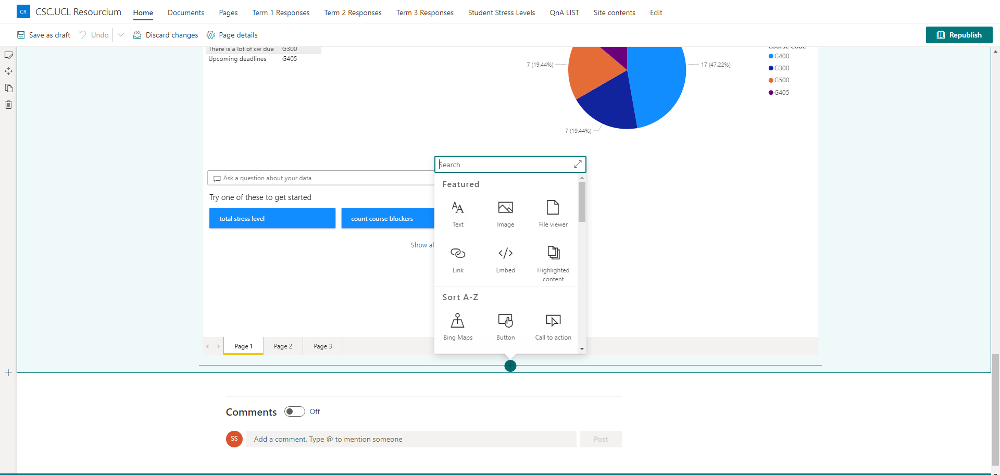
\
\
Again, the creation of the Sharepoint lists was also a no-code solution. You provide it with the columns you need and it will automatically generate these lists. Below is how the lists can be created:
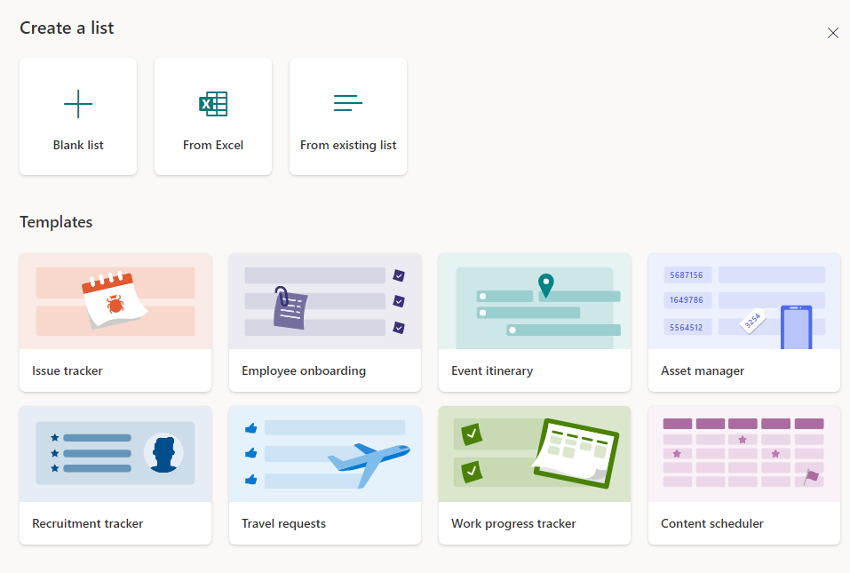
\
\
Finally, the creation of the pie charts and reporting system shown below was created through PowerBi:
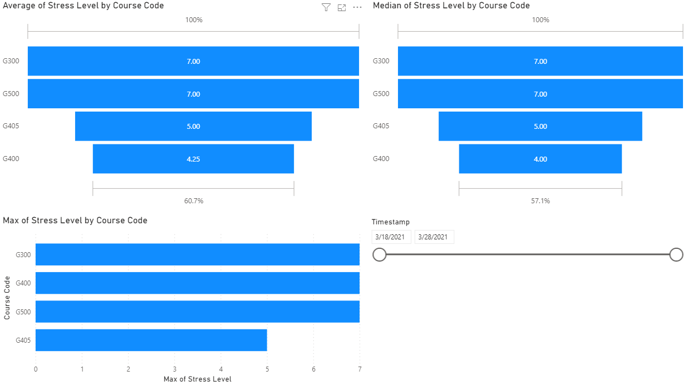
\
\
Just to show simply how we used PowerBi, here is a screenshot to show how you can select which charts to show and what data to use within those charts:
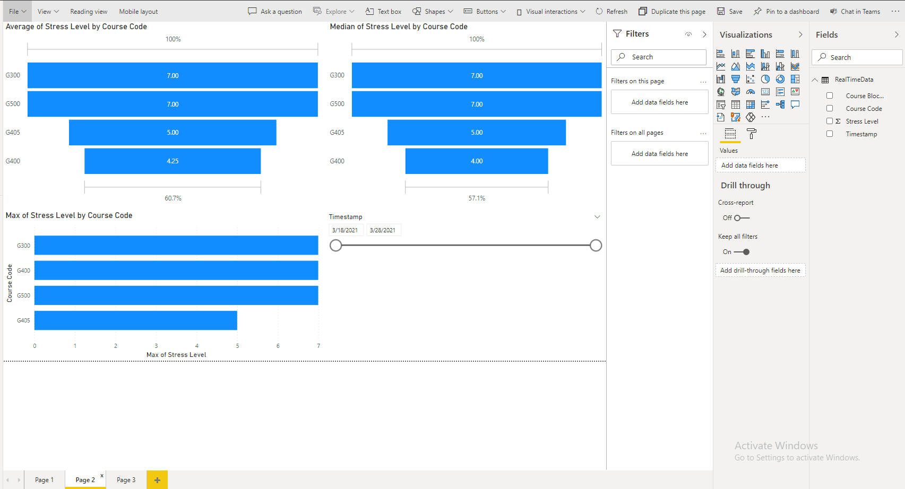
To include the above view into our SharePoint site, we would very simply need the reportID of the report that we created in PowerBi and hand it over to the SharePoint site which can then display the charts/analytics.

### Creation of the QnA Bot

The bot was created by following the steps below:

1. Created a QnAMaker resource within Azure
2. Used that resource to generate a QnA knowledgebase on the site (www.qnamaker.ai)
3. Then once that is setup, use the Web Bot tool in Azure to create the QnA bot itself connected to the knowledgebase as shown by the image below:
\
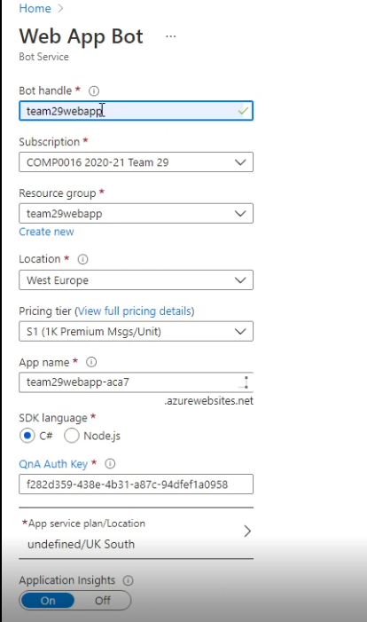
4. The token would need to be obtained from the Bot resource to connect it to the front end (the web application we made).

More details of the above can be found in the deployment manual for SharePoint where a video guide is available on exactly how to make your own one.

### How the flows work and were created
To generalise the implementation of all the data automation system, we made use of Microsoft Flows. To find reasoning on to why we used this, please check the research section of the website.

#### Implementation of the flow that automates student additional help data to SharePoint lists
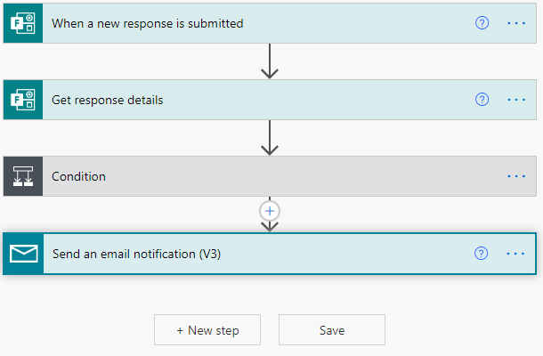
\
Above is the flow that allows the student help form data to be automated to the Sharepoint site. It looks very simple on the surface but there's a lot going on under the hood. Below I have provided a screenshot of the expanded condition part of the flow:
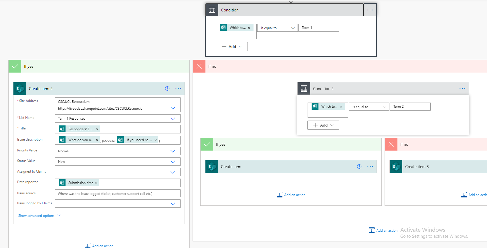
Even though this uses no code, it can be read like code. So firstly, we check here which term the form is for. This data again comes from the form which the student fills out. Depending on the input of the term, it will automatically send it to the appropriate term list as you can notice under the conditional. If it is in term 1, it will default to the yes side of the branch and store the data in the Term 1 Responses list within SharePoint. If it is Term 2 or Term 3, which would go under the no condition in the first conditional statement, then it would store the data in those appropriate lists. Within create item, you can specify exactly what form data is stored under which column in the list.

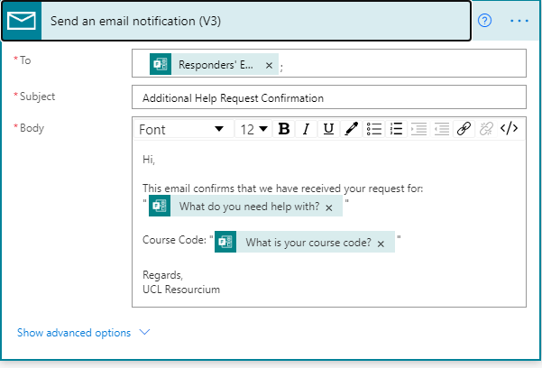
\
This is the email part expanded. Over here, we get the student email details via the MS Form and we can specify the format of the automated email that is sent to the student in order to tell them that their request has been acknowledged.

#### Implementation of the flow that automates data from student stress level form to Sharepoint list
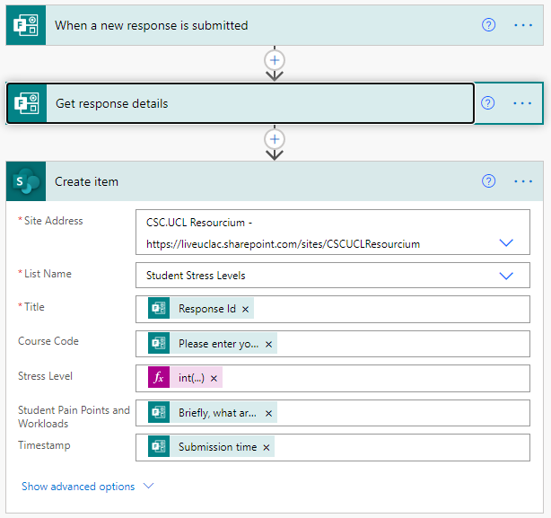
\
The above flow is what allows the student stress level forms data to be automated to the Sharepoint list. Generally, MS Flows always start off with a trigger, in the current case it would be a stress level form being submitted. After this, we get the data of the form thats been submitted and fill out the column values in Sharepoint list using this data. One key thing to note here is that since the Stress Level column is an integer, you have to convert (typecast) the incoming Stress Level data from the form to an integer in order to store it in the Sharepoint list.

#### Implementation of the flow that automates data from the student stress level form to PowerBi to setup reporting
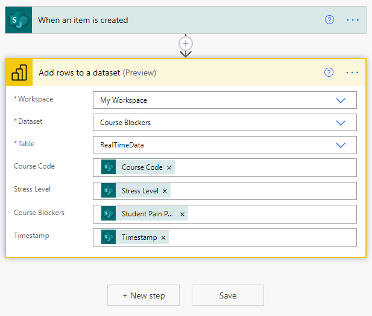
\
The above flow is connected to a PowerBi streaming dataset, that has the fields of Course Code, Stress Level, Course Blockers and Timestamp. Then, we get the stress level data stored within the Sharepoint list and direct it towards PowerBi. The advantage of using this approach is that when we do setup a reporting system for this stress level data, it will not need to be refreshed.

#### Implementation of the flow that allows pairings to be added and modified in the QnA knowledgebase
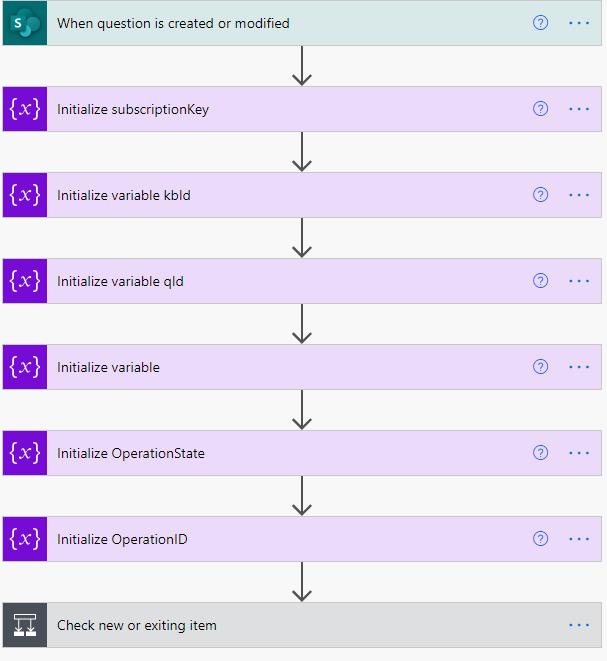
\
The above flow consists of many parts. So at the start we initialise some variables. The subscription key, kbID and endpoint variables are all related to the azure resource. These details are necessary to perform the API call that will update the knowledgebase. Below I have expanded the conditional part of the flow:
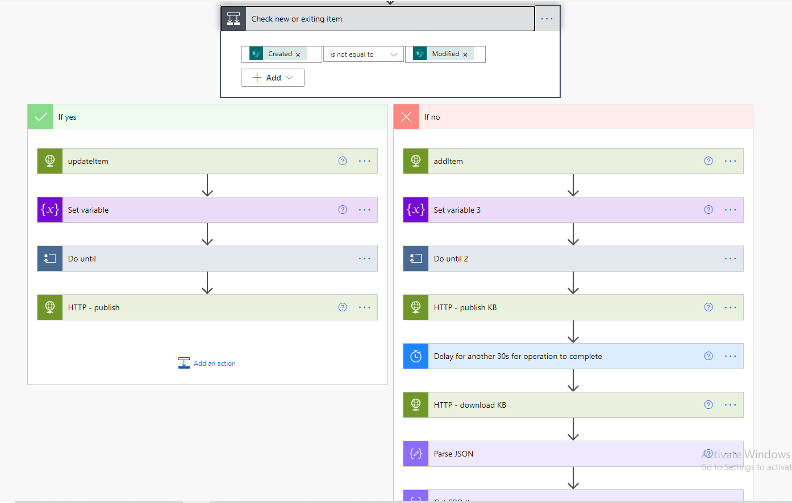
Firstly, in the yes branch we have a updateItem HTTP call, what this means is that we are calling the endpoint for the knowledgebase in order to perform an update. The conditional checks whether its a new item or modified item in the Sharepoint List. If it is a modified value, we would default to the yes of this branch. Below I have further expanded the updateItem HTTP call:
\
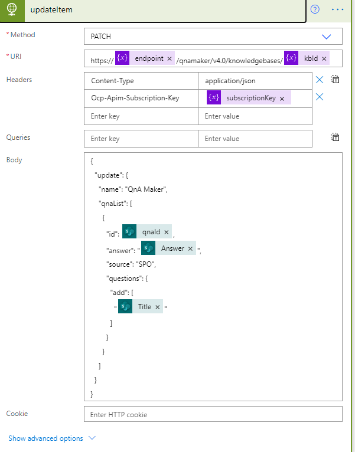
\
Clearly, in this HTTP call, we need to perform a PATCH request to the API, with the body show in the image. The body specifies essentially which QnA pair to update (this uses the qnaId stored in the Sharepoint list) and the question/answer updates. Since we have called the API to perform an update, it returns a operationID in the body of the response. We use this response to perform a "Do until" (which you will notice in the image above the one above) which checks, by again calling the API, when is the knowledgebase ready to be published. Once its ready, it calls the publish knowledgebase endpoint which can be seen below:
\
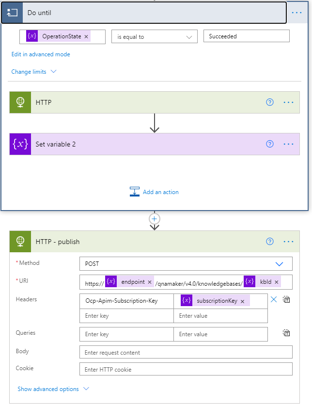
\
Now to focus on the NO of the initial branch which is if there is a new QnA pairing in the SharePoint list.
\
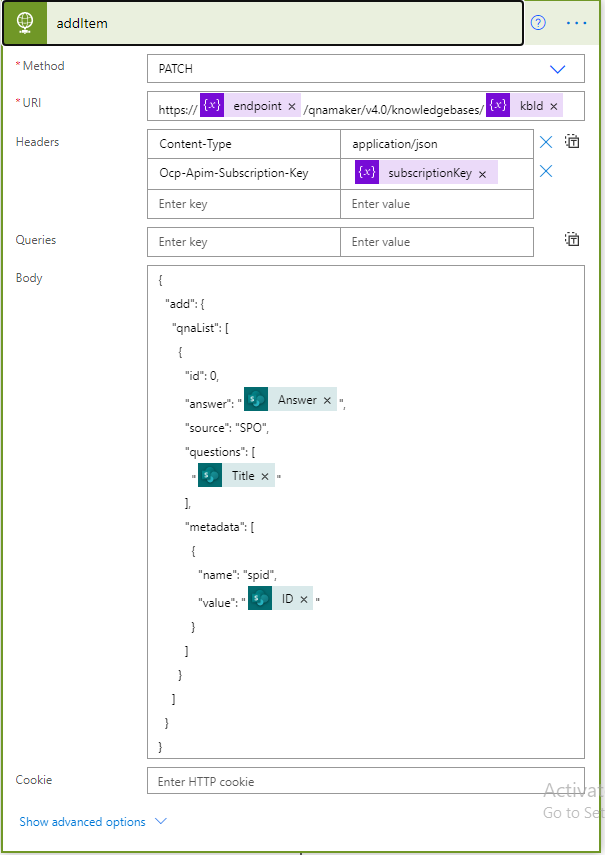
\
In the image above, you will notice another API call which has a separate body to if a QnA is modified. In this case what we are doing is providing some metadata to the values we are storing, in this case we use the ListID of the record from the SharePoint list. Title and Answer in the API call represent the Question and Answer pairing.
\

\
In the image above, you will notice that some of these are similar to the YES branch of the system, specifically the Do until and set variable tasks. Similarly to earlier, this just performs a check to see when is the knowledgebase ready to be published, then publishes it. We have to add here a manual delay of 30 seconds as we do not know when it is done with publishing the knowledgebase. After that, we download the knowledgebase and parse its data. To simplify the last few steps in the flow without further confusion, the aim of this last portion is to extract the qnaID of the question and answer pair that we just stored from the knowledgebase and add that value to the Sharepoint list (stored as a value under the column name of qnaId). This will be useful later in case the item is modified. If you noticed, in the YES branch, we provide the qnaID to the API so it knows which QnA pair is in fact being modified.

#### Implementation of the flow that allows deletion of QnA pairs from the knowledgebase
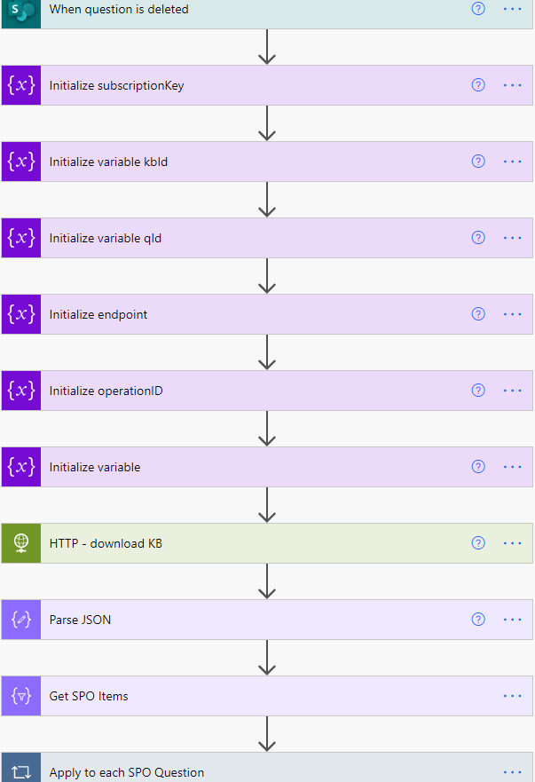
\
The above flow consists again of many parts. Just like before, the subscription key, kbID and endpoint variables are things that will need to be provided by the one deploying our system for this part to work properly. The key parts of this flow is that we first need to download the entire knowledgebase, then after we need to extract all the QnA pairs that came from our Sharepoint List. This is easy because we filter the pairs with the metadata containing "SPO". If you noticed in the API calls from the previous flow, we added a "SPO" into the metadata for the QnA pairs as well as the Sharepoint ItemID.
\
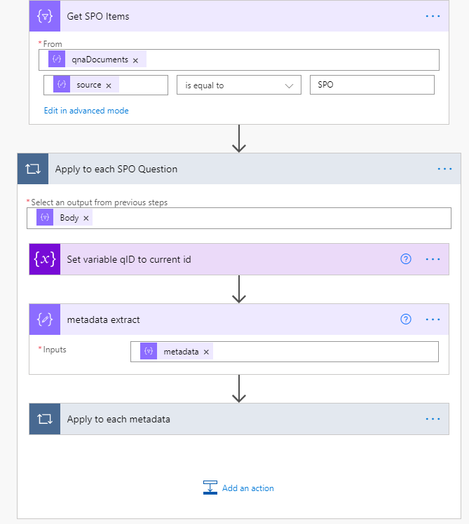
\
I have expanded the "Apply to each SPO Question" here. So once we get the data relating to just "SPO" we would loop through this and then do the following:
\

\
Then what we need to do is compare the metadata value, Sharepoint ItemID, of the QnA pair with the Sharepoint ItemID of the Sharepoint list item that has just been deleted. If we do find it, we would trigger the yes branch and delete the item from the knowledgebase. Similarly as before, it would be a API call to the knowledgebase that would look like below:
\
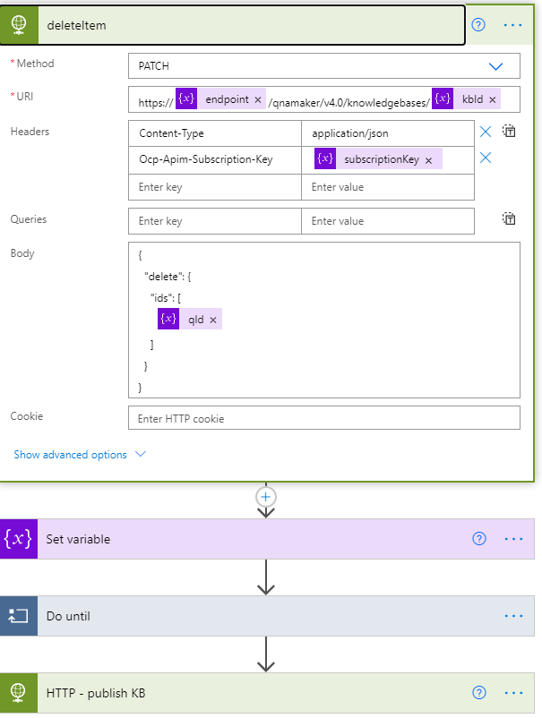
\
Clearly, all we need to provide is the qnaId of the item we want to delete once it is matched. The qnaId can be directly obtained from the metadata of the QnA pair list item. After that we perform a "Do until" like before where we query the knowledgebase endpoint on whether or not the deletion is finished. Once finished, we would publish the knowledgebase for production use.
