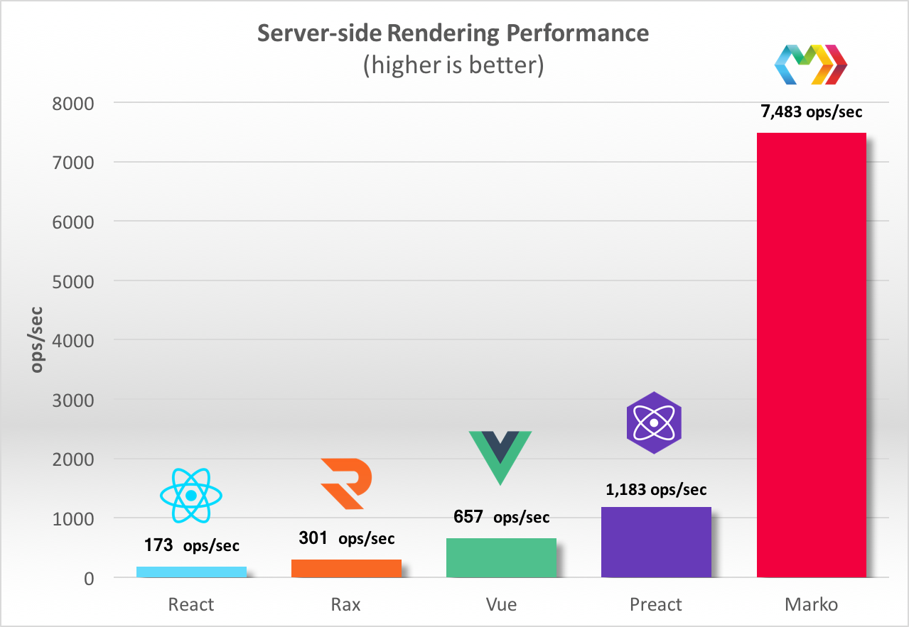

+++
title = "Research"
+++

## Existing solutions

Currently, we are producing the first ever generation of this web application. However, if we segment the parts of the web application,
then there are many existing solutions to build parts of our application with as opposed to the entire system. Below is an outline of what we looked into,
further analysis of this is available further down:

Firstly, we have to build a login system
for students, who can login via university details. The options for this include using Azure Active Directory (Microsoft Service) and setup our application through there,
alternatively we can use UCL API which is developed by students at UCL. Again the main features of this is a call to the respective APIs in order to gain access tokens so
the user can be validated through their service. The advantage for us is that it saves us the effort of setting up a separate database for the login system. What we can learn from this
is that there is ready-made code for authentication and it will need to be changed according to the context of the application.

Secondly, we need to setup a 2FA (two factor authentication system) for the online class register. There an existing number of articles that help to add this to our
web app generically. We need to make sure its using Microsoft systems hence the following is suitable for example:
[Two Factor Authentication Article](https://www.vaadata.com/blog/how-2-factor-authentication-works-and-how-to-implement-it/). This is only one example of the articles we have found that describe how to implement the system. The main feature of this is how the actual two factor authentication works in client and server side. For example, it uses Twilio to authenticate the user
by sending a SMS message to them. However, in our case we do not want to use SMS as it would potentially be too expensive. So we will instead be using an authenticator application for verification.
Even though this article is for Python Django and PHP it is useful to understand how two factor authentication works under the hood. What we can learn is
after the user has signed in we need to add another security layer, in the case of this article, describes a time based token which is generated dynamically based on time and the users secret. This secret would need to be generated by our code and then stored in a database safely.


Then the question comes to how do we store data within Sharepoint, which is in fact a completely different framework to everything. This is the only documentation we needed: [Sharepoint Link](https://docs.microsoft.com/en-us/sharepoint/dev/solution-guidance/office-365-development-patterns-and-practices-solution-guidance) It contained all the necessary information to setup a sharepoint site as well as get it to store data. So the key features in this are that a sharepoint site would need to be firstly created, then a sharepoint list needs to be created  ,which is essentially what stores the data, and finally to create the dashboard view these objects would need to be displayed to the site page. This was not enough however, as to get data to Sharepoint
we needed to gain access to the site itself. We had 2 options for Sharepoint, one was to allow our app access to all of Sharepoint (Microsoft does not allow the app access to only one site) and the other was a Microsoft Flow that automates data from a Microsoft Form to Sharepoint. Microsoft Flow is a process and task automation tool that helps connect different applications and services together. Many of these applications that can be used with Flow are cloud-based, although it is also possible to use Flow in an on-premises environment.(1) What we can learn using this
existing system, is that it is quite easy to automate data to Sharepoint so when we go on to build our app, which will include students filling out forms, it will be appropriate for it to be a 
Microsoft Form and then the forms data gets sent to a Sharepoint list via the Flow.


## Single Sign On

Our team wrote an article about implementing single sign on (SSO) and it can be found {{ internal_link(path="@/sso_article/index.md", label="here") }}.

## Device Support

This web app should support all device types, it's made for students hence compatibility between all devices is necessary.

### Detailed Research

This section is divided into parts describing programming language, frameworks, libraries, APIs and extras that we have researched for this project. Comparisons have also been made
where appropriate (where we allowed flexibility of choice).

Single Page App vs Multi Page App
The first task was to pick an appropriate language/framework to produce our system in. We had 2 options, one was to use a standard HTML,CSS,JS system and the other was to
design a single page application using React. There was a few things to consider in terms of non functional requirements which we would need to take into account.
Below is a comparison of React and traditional multi-page apps:

### Advantages of Single Page Apps over Multi Page Apps:

- Since SPAs have resources loaded beforehand, it is significantly faster than MPAs. The only thing that is sent between them is data
- With particular relation to this project, another advantage is that it makes it significantly easier to develop a mobile application because a lot of the backend
code for webapp and native app is common. For example React and React Native. Components can be interchangeably used between them according to how well defined they are.
This is important because our aim is to make a responsive app, so this allows us to first create a full blown system in React for desktop then easily integrate this with
React Native.
- Additionally, code to render pages on a server is not needed. Development can easily be started from a file URL

### Disadvantages of Single Page Apps over Multi Page Apps:
- A key disadvantage with SPAs is that they have worse security than their MPA counterparts. Particularly, they are prone to XSS(Cross-Site Scripting) attacks. This means
that hackers can inject into the app.(1)
- Since its a SPA, users cannot go back to a previous state using a back button, instead they will be return back to their previous site.
- MPAs scale significantly better than SPAs. Since MPAs can have as many pages as required, more products/services can be added easily.
- Since logic is moved out of the server and to the client side, the client would get access to functions they should not have. Therefore, if we do follow this
  approach, we will have to ensure that access control to functional level will need to be managed.(2)

### Conclusion of SPA vs MPA
Conclusively, we have decided to go ahead with a single page app. Firstly, single page apps load faster meaning it would be convenient for users. Also, SPAs are supposed to
be for lightweight applications, which works perfectly for our use case. Additionally, if we were to logically think about a thread model here, it is unlikely someone would
hack into the site with a XSS attack as there is no information stored locally, it would all be in MS Graphs. Due to the additional layer of 2FA, hacking of the register for example
is also unlikely to happen.

Which JavaScript framework to use for SPA?
There a few main frameworks/libraries to consider here in terms of what to pick:
- React: It is a front-end library that is used for creating user interfaces. It renders its own DOM in the browser meaning its performance is better. Less code needs to be
  written to do the same amount of work as other frameworks (3). Code is split into components which makes it reusable. Amongst other frameworks, it is the fastest. (4)
- React can also work with react native which helps in easier development of mobile applications meaning it would be better for further future development of this app.
  Node: It is a lightweight server side library. This library is much better to read large streams of data. Node is also highly extensible due to the existing package modules.
- Additionally, Node executes outside the browser.(5) 'It’s a lightweight and efficient JavaScript runtime environment on the server side, powered by the Chrome V8 JavaScript engine, that uses a non-blocking I/O model'.(2)
  Angular: Components are known as directives. These represent DOM elements that add behaviour once Angular finds them. HTML elements are broken down as component parts and behaves
  as Javascript code, making it different to both React and Vue.(6)

Below is a speed comparison chart between the different frameworks(7)



### Conclusion of JS Framework to use:

With regards to the information above, we have decided to go ahead with React. Firstly, it is the fastest according to the chart above in server side rendering. Secondly, it is fairly
easy to pickup as well according to many sources meaning it is appopriate to use this since 2/3 members have never done web development and we only have around 11 weeks for this project.
The requirements are also biased towards front-end development and a few api calls to MS Graphs to produce the required functionalities of the application meaning React would be suitable here.
The most important reason is that we can easily incorporate the backend code and some of the front end logic for making a native application for Android and Apple. In our first prototype we plan
on making a responsive web-app and then move that to react native during the 2nd prototype stage. 

## Technologies we want to use:

### API(s) we researched:

The main API we have researched is MS Graphs API as this was really what constituted the requirements. We can make appropriate calls to Graphs which contains user information
in order to make a personalised experience for them. This exposes a REST API to access data from MS Cloud services. For example, we can use this to develop the engagement section
where we can add a part that gets data from a students calendar and display what events they are signed upto or need to attend. Below is a link to the Graphs API:
[https://docs.microsoft.com/en-us/graph/overview](https://docs.microsoft.com/en-us/graph/overview).
Our partner introduced us to the graph explorer which lets us make example API calls to Graphs to see examples of responses we would get. 
This is particularly useful to ensure you make the right API call to the right resource. Since this app is supposed to be generic, we can define a generic API call to MS Graphs
and the only thing we would need during deployment is an authentication token from Azure Active Directory.
Again a link to this is here:
[https://developer.microsoft.com/en-us/graph/graph-explorer?request=me&version=v1.0](https://developer.microsoft.com/en-us/graph/graph-explorer?request=me&version=v1.0).

Another important API was the Microsoft Learn API. This was a simple catalog which contains the details, in a JSON format, of all the modules and learning pathways that Microsoft provided.
This was useful as our application would make a API call to retrieve this data and present it to the user in the case where they require assistance in a particular topic. In order to complete
the module, students must head over to the actual website which our app would link to. Details regarding the MS Learn API is detailed below:
[Link to MS Learn Catalog](https://docs.microsoft.com/en-us/learn/support/catalog-api).

The response body of calling this API would look as follows:
```json
{
  "modules": [ ... ],
  "learningPaths": [ ... ],
  "products": [ ... ],
  "roles": [ ... ],
  "levels": [ ... ]
}
```

We are particulary interested in just modules and learning paths so the appropriate courses according to the user input can be extracted from there.

The APIs we have researched have been quite limited as our client, Dean, was very specific with what he wanted and so our research in the API section is short.

## Summary
To summarise, we have decided to go ahead with a Single Page application, particularly React, for the front end development of our web application. 
This is because React has a React Native version so in the future a mobile application can be developed more easily. Additionally, the backend store would be a Azure Cosmos DB
in order to store user settings and preferences. The storage of user requests (ticketing system) like things they need help in would be a Sharepoint site, so staff can view it and directly respond to the student which was in fact a direct requirement of our client. This automation of data to the Sharepoint list would be facilitated by a Microsoft Flow. Also, we have decided to use the Microsoft Graph API as it is the only appropriate API available to make the application more native for the user (for example retrieve
data like their name, meetings etc.). We have also decided to go ahead with using the Microsoft Learn API to get courses because it would be readily available to students since universities which use Microsoft services are naturally given access to it.

## References
- (1) https://www.contentformula.com/blog/what-is-microsoft-flow-and-how-can-i-use-it/#:~:text=Microsoft%20Flow%20is%20a%20process,different%20applications%20a
nd%20services%20together.&text=Microsoft%20itself%20defines%20Flow%20as,%2C%20collect%20data%20and%20more%E2%80%9D.
- (2) https://rubygarage.org/blog/single-page-app-vs-multi-page-app
- (3) https://medium.com/@OPTASY.com/react-js-vs-node-js-what-are-the-main-differences-which-one-to-choose-for-your-next-web-app-7b07e344e4fb
- (4) https://www.esparkinfo.com/angular-vs-node-vs-react.html
- (5) https://stackoverflow.com/questions/56383144/reactjs-vs-nodejs-why-do-i-need-to-create-both
- (6) https://www.codeinwp.com/blog/angular-vs-vue-vs-react
- (7) https://hackernoon.com/server-side-rendering-shootout-with-marko-preact-rax-react-and-vue-25e1ae17800f
