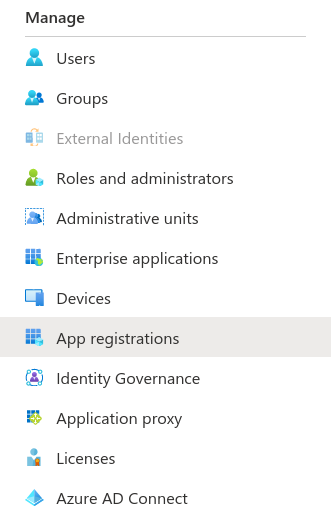
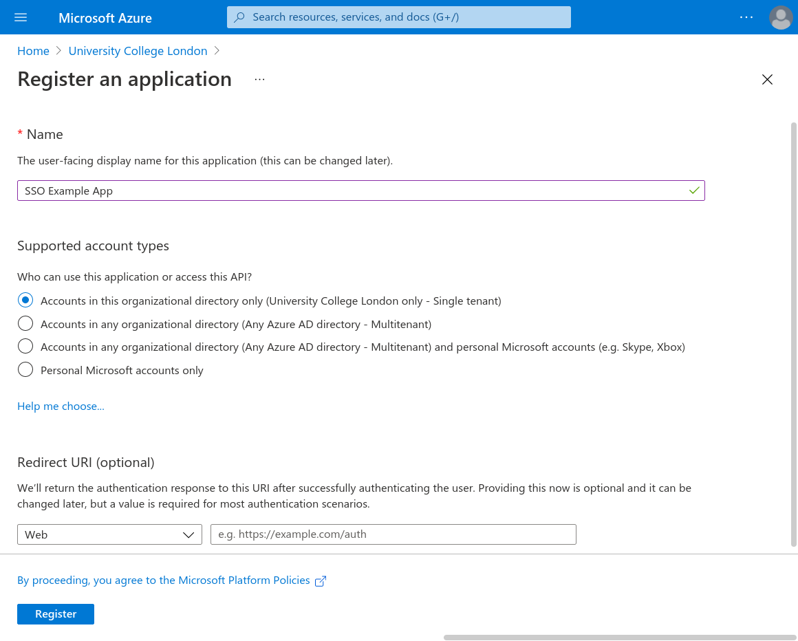
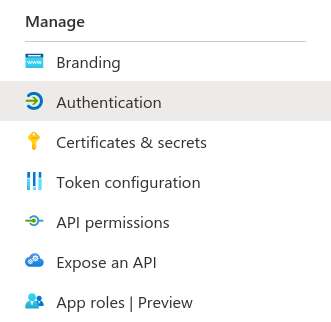
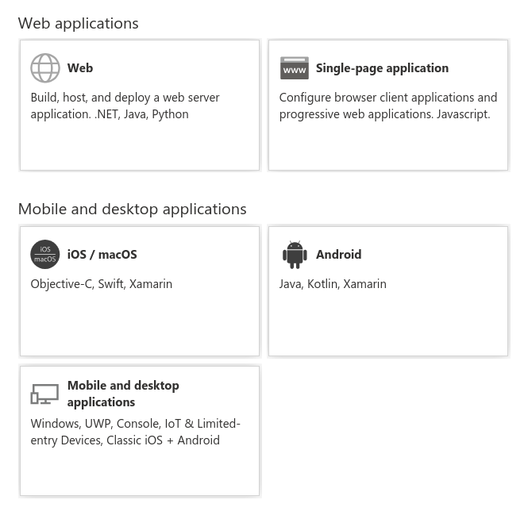
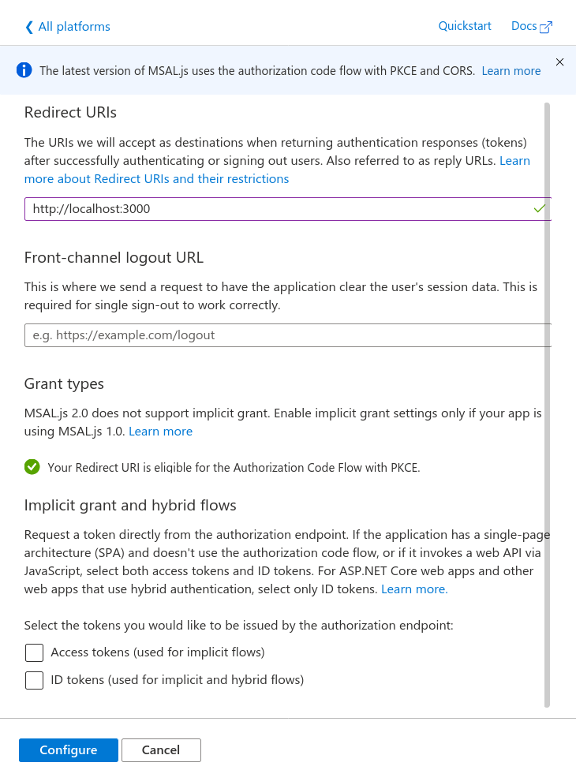

+++
title = "Implementing SSO with Microsoft Accounts (for Single Page Apps)"
+++

**Project:** UCL Resourcium

**Team members:** Louis de Wardt ({{ external_link(url="https://github.com/louisdewar/") }}), Hemil Shah ({{ external_link(url="https://www.linkedin.com/in/hemil-shah-58747b161/") }}), Pritika Shah

With the complexities that come with setting up your own database to make a login system, the best alternative would be to use Microsoft live login instead. This works by “handing” over responsibilities of login management to Microsoft as well as security technicalities. Having to design your own database with login and passwords also slows the development process, giving you less time as developers to focus on things that you need. Our project aimed to allow an easy way for students to access our application and get assistance. The simplest answer was for students to use their existing login (also known as SSO ‘Single Sign On’) to access apps. This does not only simplify things for the developer, but also the user themselves since it reduces the need for them to remember another set of usernames and passwords. This article will explain in detail on how you can setup your application to use live login directly with Microsoft.

This is designed to work for single page apps, if your app involves a web server serving each page separately then you will need to use a slightly different login flow (specifically the `Web` flow rather than the `Single-page application`)

## Setting everything up

1. You need an app registration on Azure Active Directory. Go to Active Directory -> App Registrations -> New Registration. We chose `SSO Example App`  for the app name but you can choose your own app name. You need to decide for yourself whether your app should be single or multi-tenant. We can skip the redirect URL for now but we'll need to come back to that.

These screenshots describe this process visually:



Press the new registration button:




2. You need a web based application with a button that can trigger the sign on event. An example of a simple one can be found at the end. This application also needs to be hosted on a URL. For development it is common to use `localhost`. For example react applications would be `http://localhost:3000`. If your application is composed of just static files then you'll need a local web server to host them. A simple way is to use the following command (assuming you have python installed) `python3 -m http.server 3000` which will broadcast the current directory to your local computer on port `3000`, you should be able to access your website at `http://localhost:3000` in your browser.

3. In the app registration you need to add the URL of your app to the list of allowed redirect URLs. To do this go to Authentication -> Add a Platform -> Single-page application. Then enter the redirect URL and then press configure (leave all the other values as their defaults). When you publish your app you will also need to add the public URL of the app as another redirect URL.

Here you can see screenshots showing each step:



Here you should choose `Single-page application`:



Enter in the redirect URL (such as `http://localhost:3000`)




## Code

1. Add the MSAL library for JavaScript as a dependency to your project. There are multiple ways of doing this. You can either run `npm install @azure/msal-browser` or use a CDN. This is documented officially [here](https://github.com/AzureAD/microsoft-authentication-library-for-js/blob/dev/lib/msal-browser/README.md#prerequisites).

2. You need to copy the App ID and, if you are using single tenant, you also need the tenant ID. This information can be found in the `Overview` section of the App Registration.

  Create a variable to store this information:

  ```js
  var msalConfig = {
    auth: {
      clientId: "{{APP_ID}}",
      // Only required if single tenant (remove if multi-tenant)
      authority:
        "https://login.microsoftonline.com/{{TENANT_ID}}",
    },
  };
  ```
3. Now we can create a function to start the login process:

  ```js
  function login() {
    var msalInstance = new msal.PublicClientApplication(msalConfig);

    msalInstance
    // Here you can specify scopes (see example code for more details)
      .loginPopup({})
      .then((response) => {
        if (response === null) {
          showError("There was an error authenticating you (response was null)");
          return;
        }

        showResult(response);
      })
      .catch((error) => {
        showError("There was an unexpected error during the login process");
        console.error(error);
      });
  }
  ```

Here we chose the popup method of authentication, you can also chose redirect.

The functions called `showError` and `showResult` are examples and they will likely be different in your application.

 The `response` object has a field called `accessToken` which you can use to query data on behalf of the user.

## Scopes

By default you are very limited by what you can do with the access token for security reasons. If you want to be able to perform more actions you can add scopes. Here is an example from the MSAL documentation:

```js
var loginRequest = {
    scopes: ["user.read", "mail.send"]
};
```

Now we can update the `loginPopup` parameters from earlier:

```js
msalInstance
    .loginPopup(loginRequest)
    // ... the rest of the code
```

Now the access token will have access to those scopes.

Note: you will also need to update the permissions on the app registration for all scopes **except for** `user.read` which is on the registration by default.

## Example app

Attached [here](./example_site.zip) is an example app that demonstrates using SSO login on a single page app without any frameworks (pure JavaScript).

To run you need to download the source code and host it locally such as by using `python3 -m http.server 3000`. You then need to create the app registration which will give you access to a tenant id and an app id. You should then edit the `script.js` file to update the `clientId` and `authority` (see the `msalConfig` variable). You need to set the single page app redirect URL to be `localhost:3000` or your local URL.

## Useful links

- {{ external_link(url="https://docs.microsoft.com/en-us/azure/active-directory/develop/v2-overview") }}
- {{ external_link(url="https://github.com/AzureAD/microsoft-authentication-library-for-js/blob/dev/lib/msal-browser/README.md#prerequisites") }}
- {{ external_link(url="https://github.com/AzureAD/microsoft-authentication-library-for-js/blob/dev/lib/msal-browser/docs/initialization.md") }}
- {{ external_link(url="https://github.com/AzureAD/microsoft-authentication-library-for-js/blob/dev/lib/msal-browser/docs/login-user.md") }}
- {{ external_link(url="https://github.com/AzureAD/microsoft-authentication-library-for-js/blob/dev/lib/msal-browser/docs/acquire-token.md") }}
