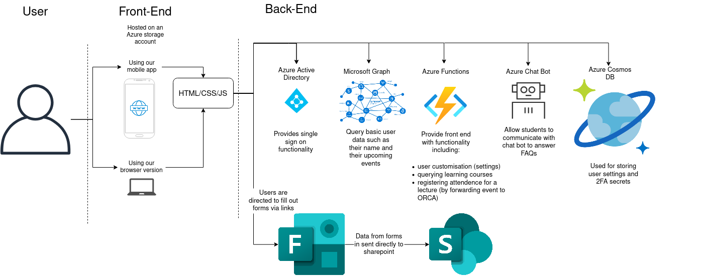
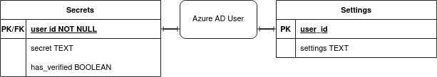
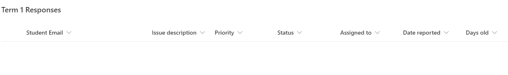
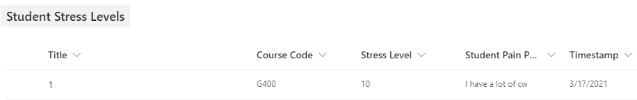
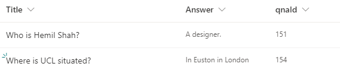
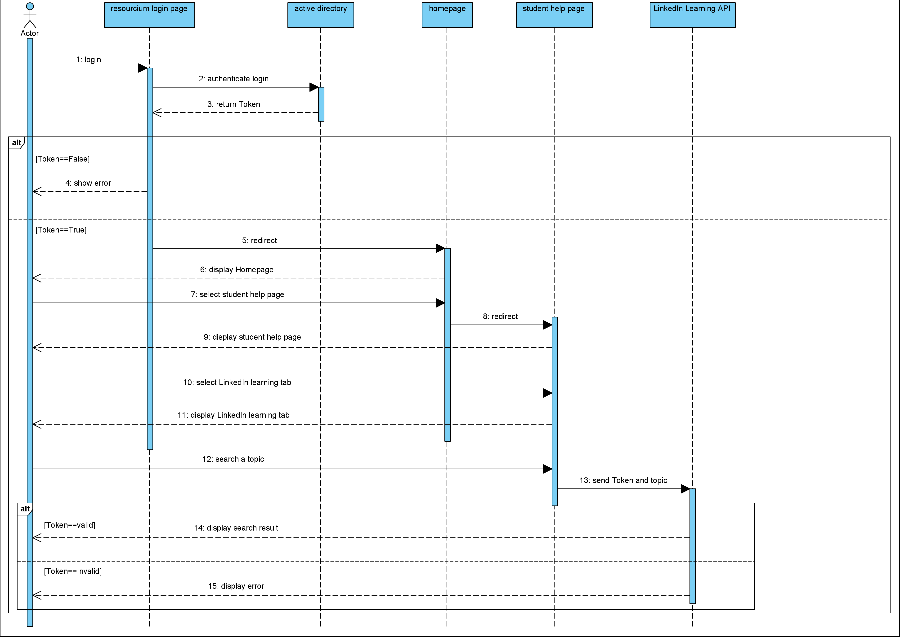
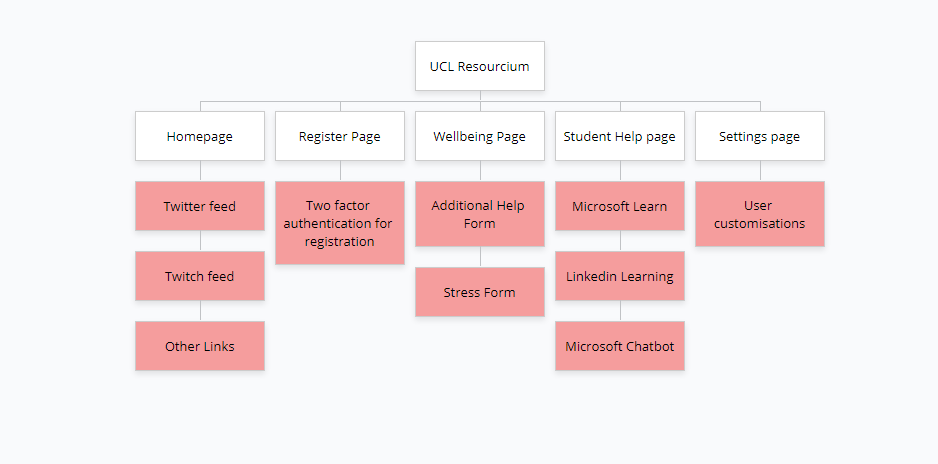

+++
title = "System Design"
+++
## System architecture diagram

This diagram shows our overall architecture omitting some minor details:

The section introduces the design of the web application. In simple terms, our system uses a typical client-server based system but what makes it different is the idea of a server-less back end, which requires something known as azure functions to make the calls.

The view the user sees is all directly from the client-side. To simplify, when a user logs in, the view that is displayed is dependent upon their settings where this data is stored as Blob storage within Azure. Before these server-less calls can be made, users need to be authenticated via Microsoft and then they are redirected to their homepage.

For example, if the user has twitch and twitter enabled within their settings, then they will be able to view them both from the homepage. Again, this makes use
of a server-less function which calls the Blob storage to retrieve this data.

User interactions are captured via the clicks which is used to eventually render the pages that they see. The main logic of the app with regards to rendering of the different pages is in the `App.js` file.
Since we are using React, it is a single page application and all the pages are split into components which uses a "Router" to access these different pages/components hence there are no specific pages programmed in by the back end.

User changes with regards to settings is updated when the user saves their new settings to the database, which is directly used in certain pages to render the appropriate view.

When the user wants to access resources, they can search via the application which essentially calls an API in order to retrieve data and display results according to the user search. The MS Learn API does not have a built-in filter for the resources it provides, hence the system has been setup to cache the data for session storage in order to minimise API calls.

The QnA bot is a simple embed which automatically handles user requests and responses internally/by itself. It uses a library provided by Microsoft called DirectLine Chat.

With regards to the forms section of the app, they are very simply links to Microsoft Forms that students fill out. The processing that happens after the form is submitted is independent of the app itself. What happens is a Microsoft Flow automates data to a Sharepoint list and PowerBi, this in turn produces real time streaming data in order to generate a dashboard to be viewed by staff in a Sharepoint site. This flow also triggers an email to the person who filled out the "Additional Help" form to acknowledge their request.

## Class Diagram
Our system does not require a class diagram as it is a web application that does not utilise a class based design. Dr Yun Fu has confirmed that our team does not require a class diagram.

## Entity relationship diagram
Our database is technically schemaless but we follow the pattern below:

## Data Storage
We not only have the above database to store information. We also have a separate system, also known as a SharePoint list. Due to the way SharePoint lists work (not a traditional database) we have not created an ER diagram for that. If you are interested in viewing what exactly the SharePoint lists store, it is shown in the screenshot below:

The above screenshot represents a SharePoint list that can store 30 million values. We have three of the same lists setup, which instead have different names corresponding to each term. So one for term 1, another for term 2 and finally for term 3. The data stored in this list comes from the Additional Help Form that we designed.

\
\
The above screenshot is a SharePoint list that stores data for the Student Stress Levels form that we have created.

\
\
The above screenshot is a SharePoint list that stores and updates the QnA pairings. This list is connected to the knowledgebase of the QnA Bot and updates it in turn. For more information on this please check the implementation page for more details on this.

## Sequence Diagram
Below is an example sequence diagram of one of our use cases of our system. This particularly covers a student coming into our web application in order to search for the resources. Out of all use cases, this would be the most complicated sequence diagram, if sequence diagrams for other use cases would be designed they would be very similar to the one shown below:

## Sitemap Diagram

