+++
title = "Testing"
+++

## Testing Strategy

Our project is a mixture of tools and code. For example, we use Microsoft Flows and SharePoint which would require manual testing whereas for the codebase, which refers to the actual web application itself, it was full of automated testing.
To simplify, we used the following test methods:
- Unit testing and Integration Testing
- Performance Testing
- Responsive Testing
- Compatibility Testing
- User Acceptance Testing

Unit tests and integration tests have been applied where appropriate in the codebase, for example performing snapshot testing which automatically checks whether or not the page that we want is rendered correctly. Unit tests were used to test API calls to ensure that no error is produced when trying to get data from the API, since our system uses quite a few (namely Microsoft Graphs, Linkedin Learning and Microsoft Learn).

### Integration and Unit Testing

#### Integration testing

We wrote integreation tests and used the front-end testing tool 'Cypress' to find bugs in our application. Cypress allowed us to stimulate tests as if a user is operating on the web app with the ability to see screenshots for each step. Cypress allowed us to write a customised  'login' commands which made writing our tests easier.

In total, we wrote 8 integreation tests aggregating to 42 test cases, testing the individual functionality as well as the User Interface of the app as a whole. 

##### Integration tests

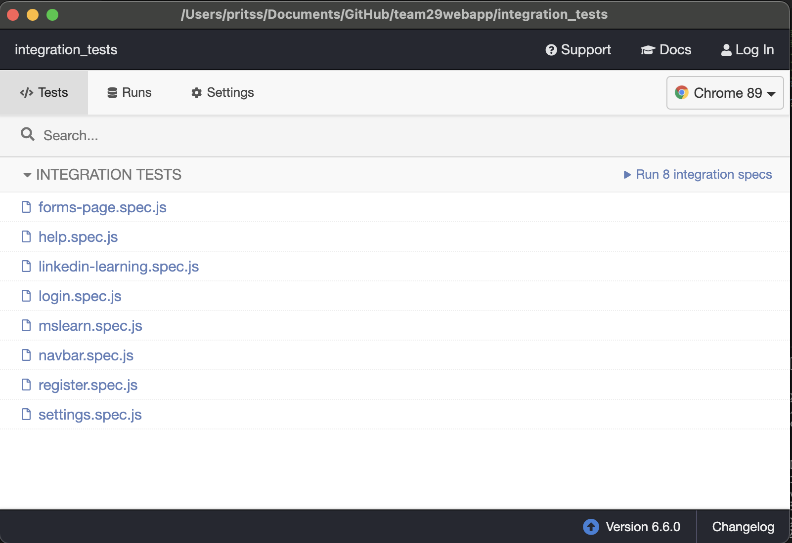
##### Test cases for each Integration test
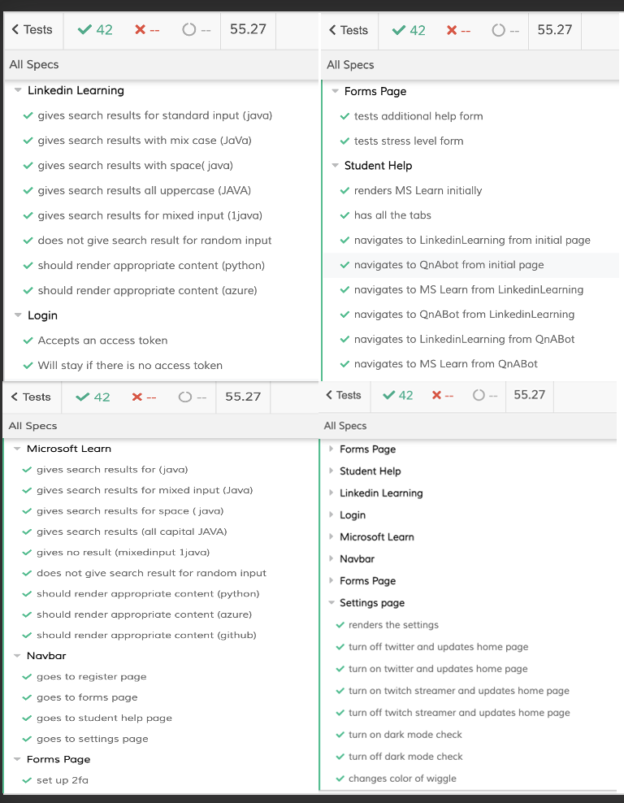

The different tests helped us find bugs for e.g. the microsoft learn search bar couldnt give search results for some of the test cases and then we solved those bugs for a better user experience.

### Performance Testing

#### PIC + WRITEUP FOR THIS?

FILLER

### Responsive Testing

It was important to check how the user interface fits into different screen sizes like different mobiles, laptops and tablets so we did responsive testing through Google Chrome's Develepor Tools.
#### Phone view
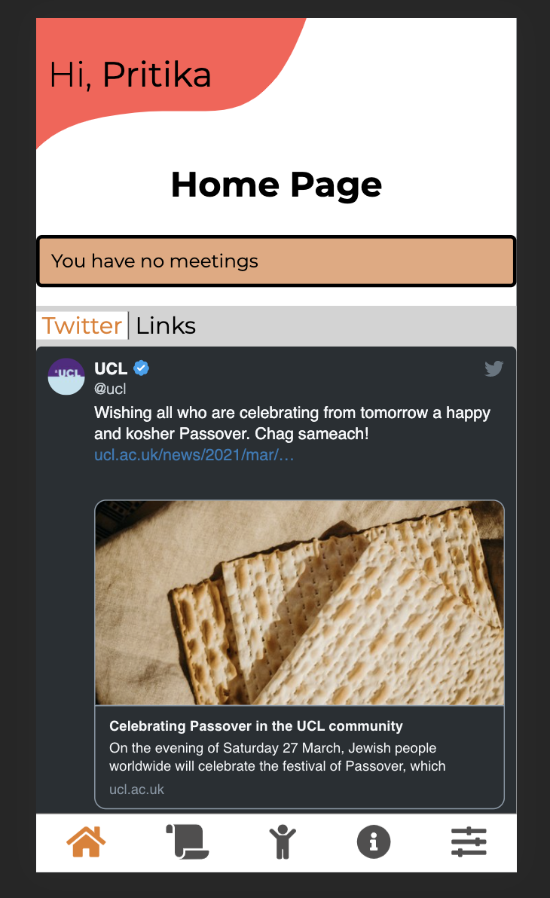
#### Tablet view
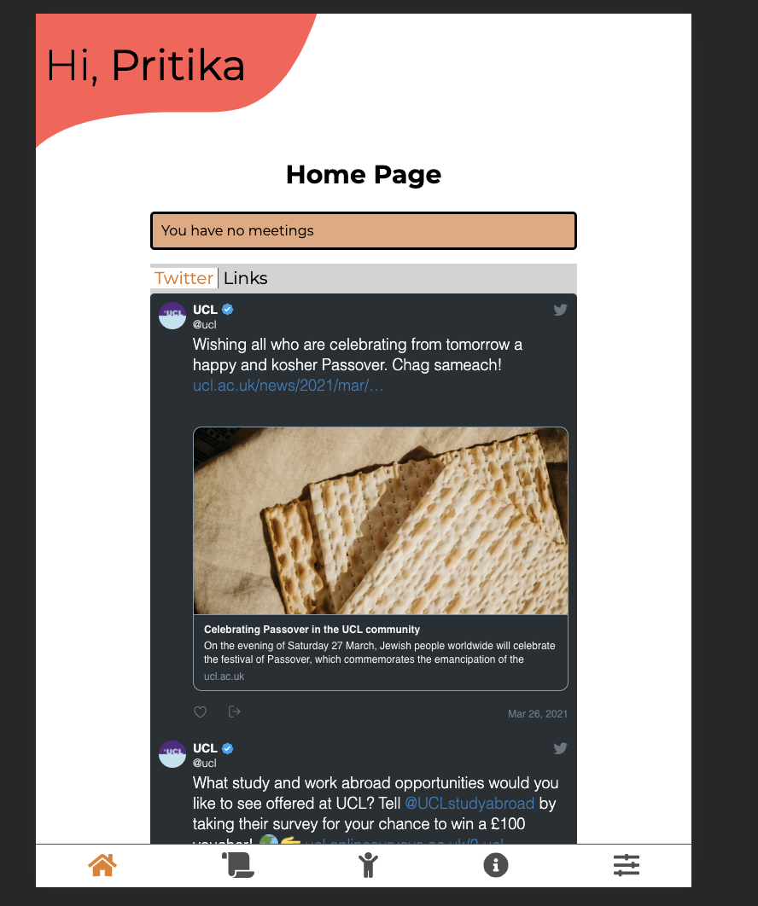
#### Desktop view
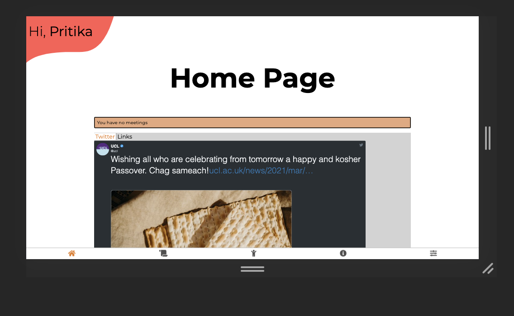

The responsive testing helped us design the user interface which adjusts to the size of the screen making it easy to use on all devices.
### Compatibility Testing

#### Test with different browsers and devices (android + ios + windows)

We tested the compatibility of our web app using different browsers: Safari, Chrome and BROWSER.
#### Chrome
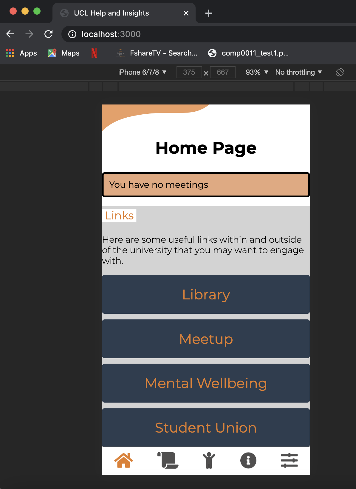
#### Safari
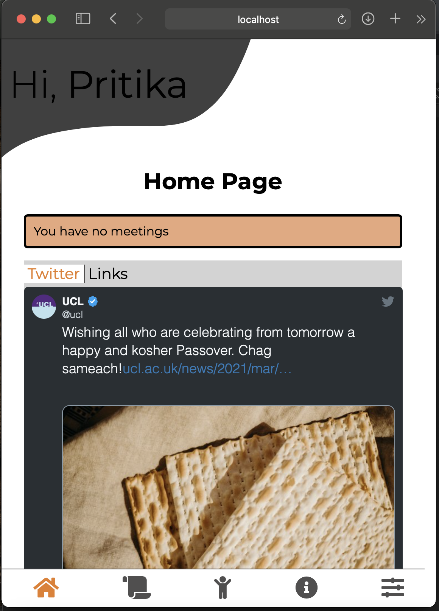
#### Firefox
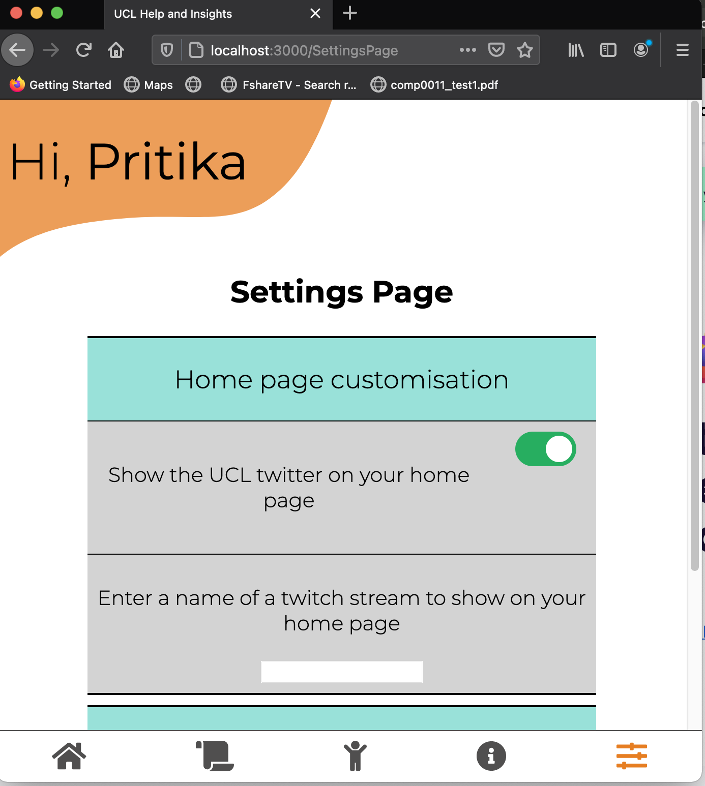

The web app worked well with the popular browsers that we tested on adn made us confident in its compatibility.

### User Acceptance Testing

#### Test with users around 5-6

FILLER - REPLACE THIS WITH RESULTS FROM THE FORMS HANDED IT AND SUMMARISE THE RESULTS

#### Feedback from client

We are pleased to say that our client, Dean and our project partner, Lee Stott (Microsoft) are satisfied with the application we have developed, considering its a first generational system.

### Manual Testing for the SharePoint and Microsoft Flows

Since this part of the system cannot be automated for testing, we performed manual testing. This involved us putting the Flow into the testing stage and manually submitting requests to it, in order to ensure the flows run. These manual tests below are necessary to ensure that data is successfully automated from one part of the system to another. It can be seen as a manual integration test to ensure that the entire flow (which is made up of components that cannot be tested individually) runs. The test tool we used for this would be the builtin test mechanism in Microsoft Flows, we have provided screenshots of this in each of the tests we have run and how exactly we ran each of the tests.

Below we have ran 5 manual tests to ensure each of the flows work:

#### Test 1 - Test the flow which automates data from the Additional Help Form to the SharePoint List

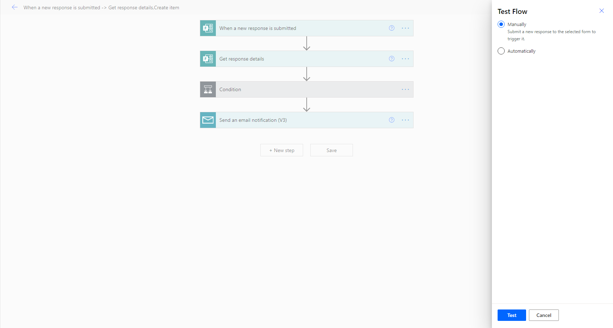
1. At the beginning of testing the flow I would click on manual and then the test button. If you notice there is an automatic test option, however that would require some triggers setup that would automatically run these tests. Due to our trigger being a form being filled out, this cannot be automated since someone will have to fill out the form to actually test it.
2. The next step is to submit a form to check whether or not the flow successfully runs.
If the flow does run successfully then it will inform you that it has worked (emphasising the end of the test). Below is a screenshot of the test flow running correctly:
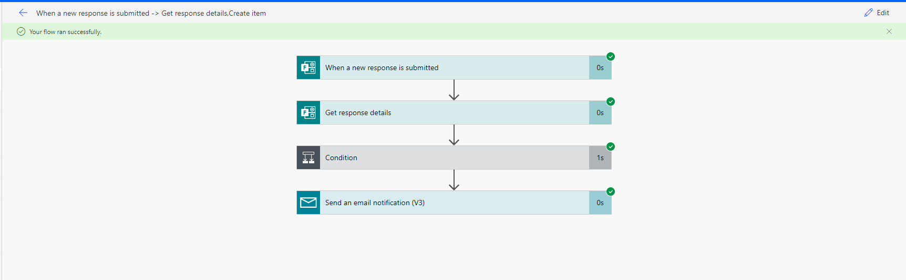

#### Test 2 - Test the flow which automates data from the Student Stress Levels form to the SharePoint List

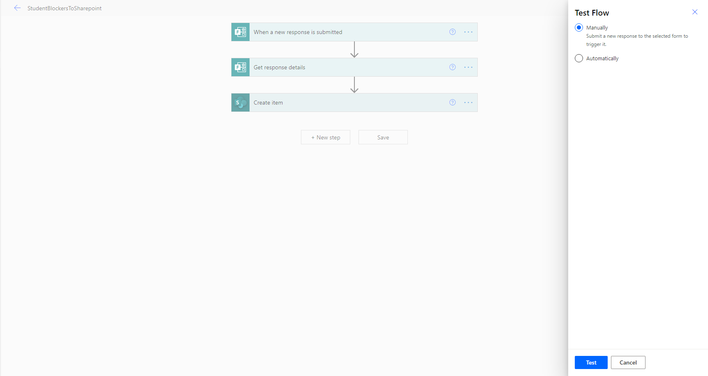
1. At the beginning of testing the flow I would click on manual and then the test button. This will put the flow in a testing state.
2. The next step is to submit the form to see whether or not the flow will run and successfully add the data to the SharePoint list.
If the flow does run successfully, then a positive response shows as shown below:
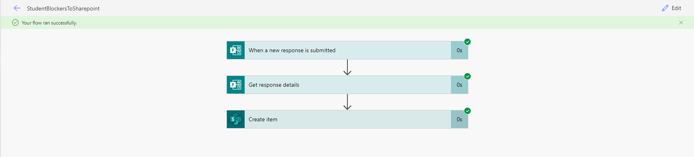

#### Test 3 - Test the flow which automates data from Stress Levels List to PowerBi for reporting

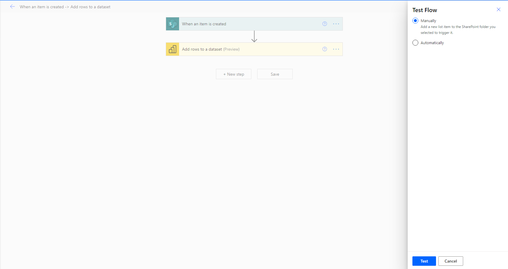
1. At the beginning of testing the flow I would click on manual and then the test button. This will put the flow in a testing state. 
2. Although the trigger for this sytem is values being added to a SharePoint list, it is easier to do this through filling out a form which will in-turn run this flow.
Since the flow ran successfully, the following response is produced:
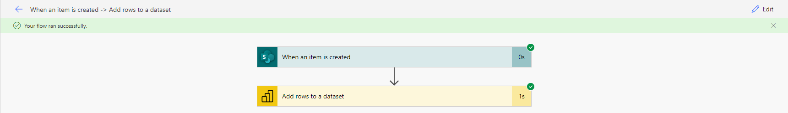

#### Test 4 - Test the flow which updates the QnA bot knowledgebase with new QnA pairings via a SharePoint list

1. At the beginning of testing the flow I would click on manual and then the test button. This will put the flow in a testing state. 
2. In this case a trigger would be adding values to the SharePoint list containing the pairings. So in this case I would add a Question and Answer pair to the list and check whether or not
the flow runs successfully. After doing so I received the below message to confirm it works:
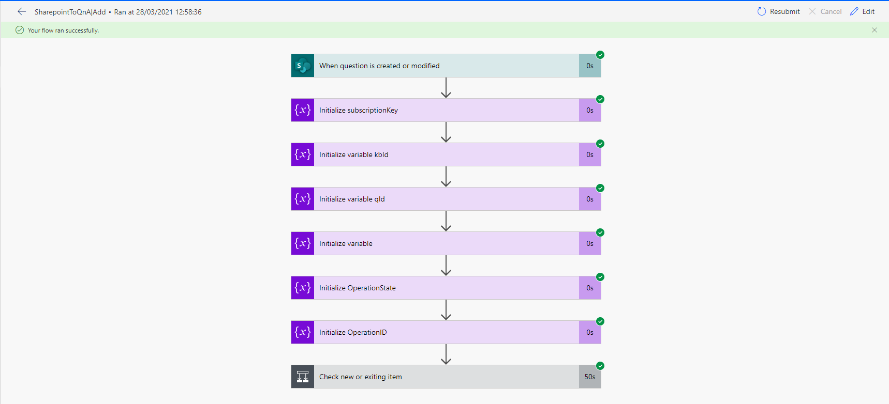

#### Test 5 - Test the flow which deletes QnA pairings from the knowledgebase using the SharePoint list

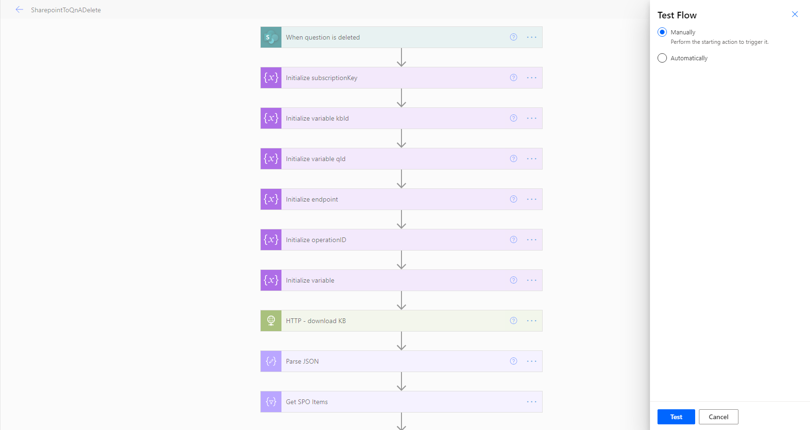
1. At the beginning of testing the flow I would click on manual and then the test button. This will put the flow in a testing state.
2. In this case, the trigger of the flow is a deletion of a QnA pairing from the SharePoint list. Below is the result of attempting to delete the QnA I added in the test earlier (Test 4):
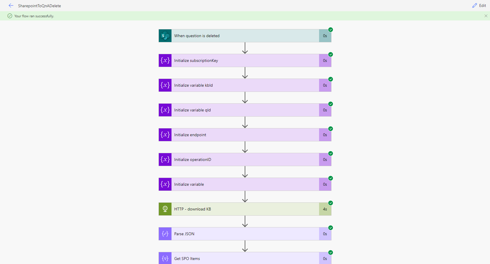

#### Conclusion of Manual Testing and MS Flows
To conclude with, the Flows testing has been successful as it runs well when attempting to perform the trigger actions that cause them to run. They also ran well during user acceptance testing when they filled out forms which triggers each of these flows. Below is an example screenshot of the flows running well during user acceptance testing:
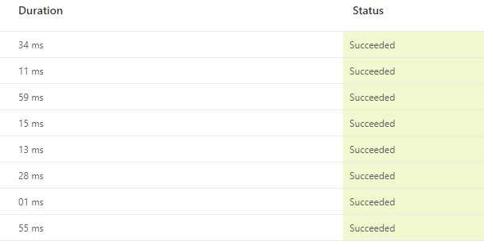
\
\
As you can see, the flows run just fine and take an extremely short period of time, relating to performance testing too. This emphasises that our system is scalable as well.