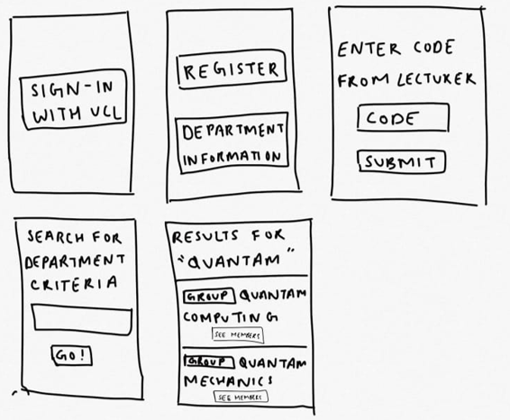

+++
title = "UI Design"
+++

## Sketches

After producing our MoSCoW list, we started the HCI section research for the interface. This was particularly important as the application
was for students and user experience would be the key target of this application apart from the data collection and insights. While designing the 
interface we also made sure to keep contact with our client in order to keep them updated and keep the design focussed. To ensure a usable design,
we took the following goals in mind(1):

- Accessibility: Since this was a student based application, a responsive design would be very important as students may want to use the application on their phones
as opposed to tablets. Mobile responsiveness within the web app would be very important (i.e. taking a mobile first approach and then upscaling the website from there).
- Availability: Ensure that any forms for points of data collection or external links are not broken otherwise it would ruin the user experience
- Clarity: It is necessary that students can do what they need to in this application. In this case they should be able to setup their two factor authentication and be able to 
  register themselves for their lecture (We only need to make the front end design for this where students need to get authenticated via a time based one time password, the backend
  would be university specific and would break the point of easy deployment for our application). Under this follows consistency, meaning the design is quite unibody and easy to follow.
- Simplicity: As simple as this ones sounds, the design of the application should be straightforward (i.e. no clutter with a neat user interface).

Here are the sketches we produced (they are not the most beautiful but wait till you see our high fidelity wireframe):

**Note: The sketches shown here are based on the initial requirements we were given, over the course of the year these changed and design changes/decisions were made. For example the second sketch has a staff login which was in fact removed later as application was limited to students. Hence the view for staff within this app has been omitted.**

## HCI Interactive Prototype

After many re-adjustments to the initial design and hours of thinking, we came up with a fresh design on the prototype which was loved by our client due to its clean design. We used Figma to create this prototype as it was easy to use. Here is our live prototype which may take a while to load in:

<iframe style="border: 1px solid rgba(0, 0, 0, 0.1);" width="800" height="450" src="https://www.figma.com/embed?embed_host=share&url=https%3A%2F%2Fwww.figma.com%2Fproto%2F3bqgcBSOyj7AyyrgbBe9EJ%2FHCI%3Fnode-id%3D2%253A2%26scaling%3Dscale-down" allowfullscreen></iframe>

Some things that are notably important is how drastically we changed our initial sketches to this UI Design. The reason in particular was easier navigation. What else you can notice is we have tried to make coupling between the application and UCL as minimum as possible. For example even though the load in screen uses the UCL logo, when universities deploy our application they will just need to replace that image with their own universities image. The Hi, Hemil that you may have noticed in the wireframe is pulled from MS Graphs (taking data directly from Microsoft Azure Active Directory) so once universities setup our application into their eco system, not much tweaking would be necessary.

## Evaluation of prototype:

Our team sent this prototype to many users and asked them to comment on how our prototype was which was a form of informal feedback. Using this feedback we came up with the table below as our improvements to be made for the prototype to make it more usable:

## References
- (1) https://www.crazyegg.com/blog/principles-website-usability/

 
